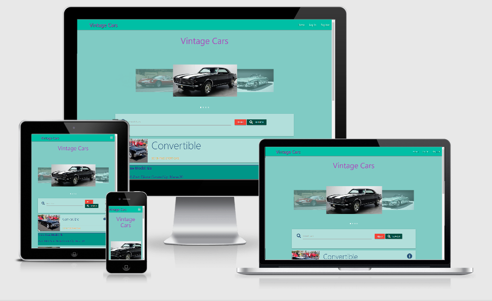

# Vintage Cars


******************************************************************************************************
## Table of Contents
1. [**UX**](#ux)
    - [**User Stories**](#user-stories)
    - [**Design Choices**](#design-choices)

2. [**Features**](#features)
    - [**Functionality**](#functionality)
    - [**Existing Features**](#existing-features)

3. [**Wireframes**](#wireframes)
    - [**Database Schema**](#database)

4. [**Technologies used**](#technologies-used)
    - [**Language**](#language)
    - [**Tools Used**](#tools-used)

5. [**Testing**](#testing)
    - [**Testing User Stories**](#testing-user-stories)
    - [**Responsive Testing**](#responsive-testing)
    - [**Functional Testing**](#functional-testing)
    - [**Code Validation**](#code-validation)
    - [**Errors**](#errors)

6. [**Deployment**](#deployment)

7. [**Credits**](#credits)
    - [**Content**](#content)
    - [**Media**](#media)
    - [**Acknowledgments**](#acknowledgments)

******************************************************************************************************
### Project

My main purpose for this website is to catalogue contains information about various vintage car brands. From the most popular to rare, and even those that no longer exist. It’s for all those lovers and followers interested in models and brand, who wants to share their knowledge on a regular basis. It`s name, year, picture, all this information is included in the car catalogue available on the App. And also, to improve the search for a model on the list, which makes it easier to identify.

### Project Rational

This app was created for the Data Centric Development project of [**_Code Institute's_**](https://codeinstitute.net/) Full Stack Software Development course. The project scope was to create a web app using Python and a MongoDB, which uses **CRUD** operations to allow users to easily create, read, update and delete data from a database viewed through a web application.

This was developed as both a front-end and backend project. The technologies used for each are:
- Frontend: HTML, CSS, JavaScript
- Backend: Python, Flask, MongoDB
- Hosting: Heroku
- Database: MongoDB


## UX

### User Stories

The following user stories have been identified:

1. As a user, I want the home screen to be visually appealing and easy to navigate.
2. As a user, I want to be able to start register easily.
2. As a user, I want to be able to start login and logout easily.
3. As a user, I want to be able to add a car.
7. As a user, I want to be able to edit a car.
4. As a user, I want to be able to delete a car.
5. As a user, I want to be able to search to find the exact car.
6. As a user, I want to be able to access this website from different devices easily.

### Design Choices

#### Fonts

- The font that was chosen for this page is "Architects Daughter". Its appearance fits into the vintage style of the site.

#### Colours

- The colours that was chosen for this page are:
    
    - #80cbc4 - body background
    - purple - logo
    - teal - car card, navbar
    - gray - category card
    - blue - text login, register and flash messages 
    - #245079fd - card title, icon and buttons
    - rgb(82, 82, 136) - car card border
    - rgba(40, 47, 49, 0.8) - text shadow on navbar and footer

Colors are used in different shades of darkness and accents from Materialize colours.

#### Styling

- The website has been designed to be clear, easy to use and adapted to UI and UX patterns. The site should not be a problem for the user as it is designed in an easy to navigate style. The selected color palette is eye-catching and color-matched to avoid overwhelming the intensity of the shades.

##### Back to [Top](#table-of-contents)

## Features

### Functionality

This app makes use of Python logic to enable users to login and, or register for an account. 
The CRUD features that are available through using Python and Mongodb allow users to create, read, update and delete records in a variety of manners:

- Create car list
- Create a user account
- Read car list
- Read/view car list by all users
- Update their car list
- Update their profile
- Delete a car list

### Existing Features

**Navbar Links** 

The navbar contains the following links to all users:

- Logo
- Home
- Login
- Register

When the user is registered and logged in, the navbar will show 'Profile' and 'Add cars' buttons.

**Navbar after logged in as user**

The following are the nav bar links when a user is logged in:

- Logo
- Home
- Profile
- Add Car
- LogOut

**Navbar after logged in as Admin**

- Logo
- Home
- Profile
- Categories
- Add Car
- LogOut

As a Admin you can create, read, edit and delete Categories and Cars.

**Home Page** 

The Home page displays the cars added to the category. The "search" option is added to facilitate the search.

**Profile Page**

The Profile page displays the cars added by the user.

**Register Page**

The Register page displays the form to register by the user or if user already have an account link to Login page.

**Login Page**

The Login page displays the form to login by the user or if user is new to link to Register page.

**Add Car Page**

The Add Car page displays the form to add car by the user.

**Categories Page**

The Categories page displays all categories that have been added by Admin. This page can be create, read, edit and delete only by Admin.


##### Back to [Top](#table-of-contents)

## Wireframes

- [Wireframs Home Page](/static/img/wireframe_home_page.png)
- [Wireframs Category Page](/static/img/wireframe_category_page.png)
- [Wireframs Register Page](/static/img/wireframe_register_page.png)
- [Wireframs Login Page](/static/img/wireframe_login_page.png)
- [Wireframs Profile Page](/static/img/wireframe_profile_page.png)
- [Wireframs Add Car Page](/static/img/wireframe__add_car_page.png)
- [Wireframs Edit Car Page](/static/img/wireframe__edit_car_page.png)
- [Wireframs Add Category Page](/static/img/wireframe__add_category_page.png)
- [Wireframs Edit Category Page](/static/img/wireframe__edit_category_page.png)

## Database

- [Database Schema](/static/img/database.pdf)


##### Back to [Top](#table-of-contents)

## Technologies Used

### Language

- HTML - standard language used to create this page.
- CSS - standard language that describes the style of HTML.
- Javascript - standard language for game functions.
- Materialize - The project uses the Materialize framework to add a responsive grid system, prebuilt components, plugins built on jQuery, and Materialize styles to my app, before adding my custom styles.
- Python - used as the back-end programming language for app. 
- Flask - used Flask, which is a Python microframework.
- Jinja - used for templating with Flask in the HTML code. It allow simpler linking of the back-end to the front-end.
- JQuery - used to simplify DOM manipulation.
- PyMongo - used as the Python API for MongoDB. This API enables linking the data from the back-end database to the front-end app.
- MongoDB - used to store the database in the cloud. The information displayed in the front-end app is pulled from the database store.
- Github - used to host the repository.
- Heroku - used to host the app.
- Font Awesome - to style the website icons.

##### Back to [Top](#table-of-contents)

## Testing

### Testing User Stories

Testing user stories:

- Create a new account(Register)
- Login to user account
- Logout from user account
- Use navbar links to move in to different pages(Home, Profile and Add Car)
- Create new car card
- Read car card
- Edit car card
- Delete car card  

### Responsive Testing
The project was tested on development tools in Google Chrome, Microsoft Edge and the responsiveness of mobile devices and Ipads was also tested.

- Moto G4
- Galaxy S5
- Pixel 2
- Pixel 2XL 
- Iphone 5/SE 
- Iphone 6/7/8
- Iphone 6/7/8Plus
- IphoneX
- Ipad
- Ipad Pro 
- Surface Duo 
- Galaxy Fold 

1. Testing was done on a http://ami.responsivedesign.is/, which has been used to see how the site performs on different devices and their viewports. All pages, links, icons performed as expected on all devices. I also used it to create the all-devices.jpg at the top of this Readme file.

2. Testing was done on my apps responiveness in Chrome and Microsoft Edge on different size mobile, tablet and Desktop to ensure that the responiveness worked and the site is funcitonal at all sizes.
    - Tested on Desktop (My Pc)
    - Tested on Tablet (Ipad 7, Samsung Galaxy 7)
    - Tested on Mobile ( Iphone 7, Samsung A20)

3. Testing was done by the Slack community, my mentor from the Code Institute and my friends and family.

Testing consists of finding any errors that could reveal incorrect operation of the website during its use. The website was also tested on private mobile devices like Iphone 7, Samsung A20 and Ipad 7.

All problems related to the functioning of the site have been resolved.

### Functional Testing

In the functionality test, I check that all elements are working properly:

- Logo link
- Navbar Links
- Search Panel
- Cards information after reveal
- Buttons  
- Flash messages

### Additional Testing

For additional testing, I created a few accounts from which I made:
- Registering
- Login
- Signing out
- Adding cars
- Editing cars
- Deleting cars
- Adding categories
- Editing categories
- Deleting categories
- Use links in navbar and mobile navbar

### Errors

- The first of the errors that appears from time to time is a "net::ERR_NAME_NOT_RESOLVED" error in profile.html, cars.html and categories.html image replacement
   - onerror="this.onerror=null;this.src='static/img/avatar_car.jpg'", onerror="this.onerror=null;this.src='static/img/avatar_car2.jpg'" 
- The second error I noticed in the safari browser when you want to choose option in add_car.html and edit_car.html there are two menus to open.
- The third error was a spelling mistake I made in the env.py file and it did`t work as it should. 

### Code Validation

- I used the [W3C HTML Validator tool](https://validator.w3.org/#validate_by_input) to validate my HTML code.
- I used the [W3C CSS Validator tool](https://jigsaw.w3.org/css-validator/#validate_by_input) to validate my CSS code.
- I used the [JSHint Validator tool](https://jshint.com/) to validate my JavaScript syntax.
- I used the [Pep8 Online tool](http://pep8online.com/) to validate my Python syntax.

##### Back to [Top](#table-of-contents)

## Deployment

I used GitHub for my version control and Heroku to host the live version of my project. To deploy my website to Heroku, I used the following steps:

1. Created the app in Heroku.
2. Run the `npm install heroku` command in the terminal window to instal heroku in my local workspace.
3. Ran the `heroku login -i` command in the terminal window and entered my credentials to login to Heroku.
4. Added and committed the files to Git using the `git add .` and `git commit -m ""` commands in the terminal window.
5. Linked the Heroku app as the remote main branch using the following command in the terminal window:

    ```git remote -v <app-name>```
    ```git remote add <app-name>```
    ```git remote add <link-name>```
    ```git push -u heroku main```

6. Created a requirements.txt file using the following command in the terminal window:

    ```pip3 freeze --local > requirements.txt```

7. Created a Procfile using the following command in the terminal window:

    ```echo web: python <fileName.py> > Procfile```

8. Entered the following Config Var in Heroku:

    ```MONGO_URI : <link to MongoDB>```


The app was successfully deployed to Heroku at this stage.

### Live App Link

Click the link below to run my project in the live environment:

[Vintage Cars](https://cars-vintage-project.herokuapp.com/)

### Repository Link

Click the link below to visit my project's GitHub repository:

[Vintage Cars](https://github.com/Maras00/MS3)

### Running Code Locally

To run my code locally, users can download a local copy of my code to their desktop by completing the following steps:

1. Go to [my GitHub repository]
2. Click on 'Clone or download' under the repository name.
3. Copy the clone URL for the repository in the 'Clone with HTTPs section'.
4. Open 'Git Bash' in your local IDE.
5. Change the current working directory to the location where you want the cloned directory to be made.
6. Type `git clone`, then paste the URL you copied in Step 3:

    ```git clone https://github.com/USERNAME/REPOSITORY```

7. Press `Enter` to complete the process and create your local clone.
8. Create a new Database in MongoDB  
9. Create collections 
9. Navigate to the `.bashrc` terminal and add your MongoDB URI in the following format:

    ```MONGO_URI="insert your mongo uri details here"```

10. In the terminal, run the `pip3 install -r requirements.txt` command to install the requirements.txt file.
11. You should now be able to run the app locally using the `python3 run.py` command.

##### Back to [Top](#table-of-contents)

## Credits

### Content

- The content for the application was created by myself.

### Media
- The images for cars were copied from [Google Gallery](https://www.google.com/search?q=vintage+car+images&sxsrf=ALeKk00GoLunCwUHYr2qjGQahEIGBgS5uA:1612485434376&source=lnms&tbm=isch&sa=X&ved=2ahUKEwiizZWswNHuAhXtZxUIHUEZCYsQ_AUoAXoECA8QAw&biw=1366&bih=625) 

### Acknowledgements

- I received inspiration and help for this project from my mentor and Slack community.
- I received inspiration and help for this project from [TaskManagerAuth tutorial](https://github.com/Code-Institute-Solutions/TaskManagerAuth/tree/main/08-SearchingWithinTheDatabase/01-text_index_searching)
- I got additional help from Stack [Overflow](https://stackoverflow.com/) and [W3 Schools](https://www.w3schools.com/).
##### Back to [Top](#table-of-contents)